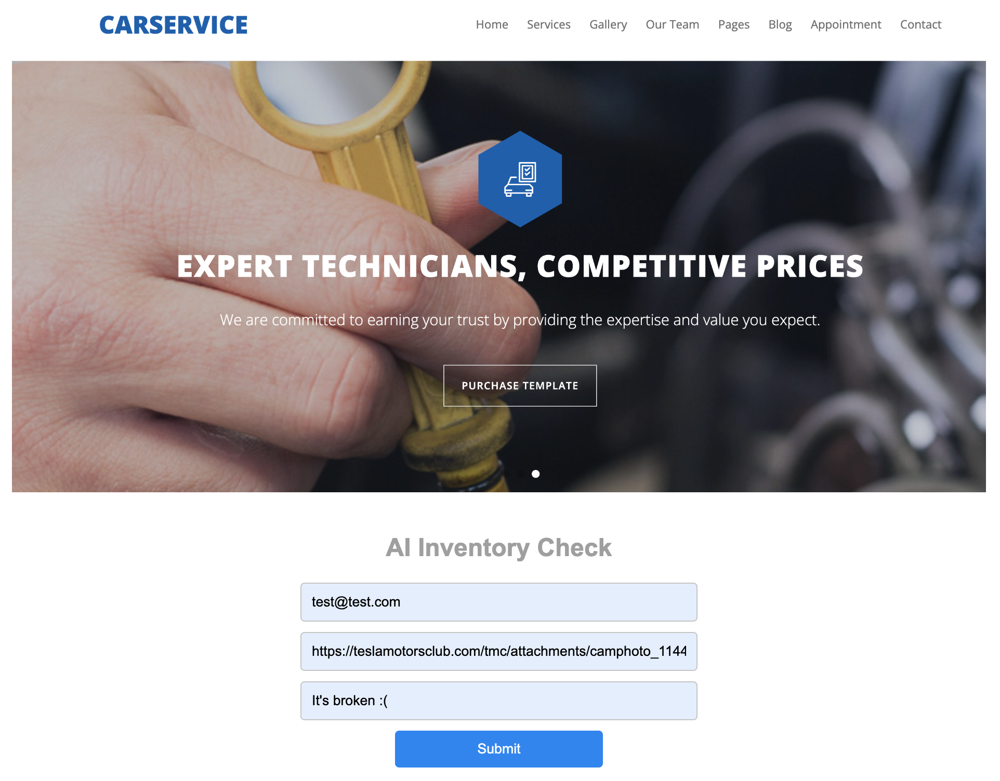
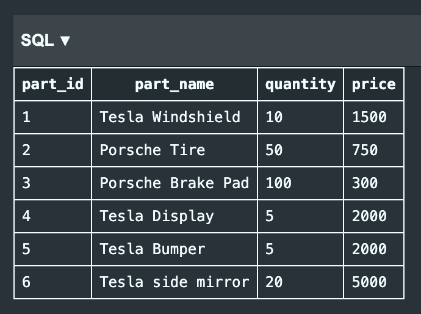
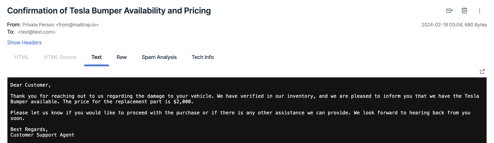

Real World Project: Developing an AI Team for a Garage
======================================================

To run, setup **OPENAI_API_KEY** in both runtime environment and `OAI_CONFIG_LIST` file. And **SMTP_PASSWORD** to access https://mailtrap.io, then:

```
$ rm -rf .cache/ __pycache__/

$ python app.py
```



Goto http://127.0.0.1:5000/, input contact email e.g. `test@test.com`, a message e.g. `It's broken`, and damaged vehicle's photo e.g. https://teslamotorsclub.com/tmc/attachments/camphoto_1144747756-jpg.650059/ or https://cdn.motor1.com/images/mgl/o6rkL/s1/tesla-model-3-broken-screen.webp, click **Submit** button.

image::Damaged Car.png[Damaged Car]

The output in debugging window:

```
Mail: test@test.com
user_proxy (to chat_manager):


                Process Overview:
                Step 1: Damage Analyst identifies the car brand and the requested part (is something central, or something broken or missing) from the customer's message and image.
                Step 2: Inventory Manager verifies part availability in the database.
                Step 3: Customer Support Agent composes and sends a response email to the customer.

                Customer's Message: 'It's broken :('
                Email of the customer: 'test@test.com'
                Image Reference: 'https://teslamotorsclub.com/tmc/attachments/camphoto_1144747756-jpg.650059/'


--------------------------------------------------------------------------------

>>>>>>>> USING AUTO REPLY...
damage_analyst (to chat_manager):

The image shows a damaged Tesla vehicle. The part that is broken appears to be the rear bumper area, which is visibly hanging off and detached from the body of the car.

--------------------------------------------------------------------------------
inventory_manager (to chat_manager):

***** Suggested function Call: get_inventory *****
Arguments:
{}
**************************************************

--------------------------------------------------------------------------------

>>>>>>>> EXECUTING FUNCTION get_inventory...
user_proxy (to chat_manager):

***** Response from calling function "get_inventory" *****
[{'part_id': 1, 'part_name': 'Tesla Windshield', 'quantity': 10, 'price': 1500}, {'part_id': 2, 'part_name': 'Porsche Tire', 'quantity': 50, 'price': 750}, {'part_id': 3, 'part_name': 'Porsche Brake Pad', 'quantity': 100, 'price': 300}, {'part_id': 4, 'part_name': 'Tesla Display', 'quantity': 5, 'price': 2000}, {'part_id': 5, 'part_name': 'Tesla Bumper', 'quantity': 5, 'price': 2000}, {'part_id': 6, 'part_name': 'Tesla side mirror', 'quantity': 20, 'price': 5000}]
**********************************************************

--------------------------------------------------------------------------------
customer_support_agent (to chat_manager):

***** Suggested function Call: send_mail *****
Arguments:
{
  "subject": "Confirmation of Tesla Bumper Availability and Pricing",
  "body": "Dear Customer,\n\nThank you for reaching out to us regarding the damage to your vehicle. We have verified in our inventory, and we are pleased to inform you that we have the Tesla Bumper available. The price for the replacement part is $2,000.\n\nPlease let us know if you would like to proceed with the purchase or if there is any other assistance we can provide. We look forward to hearing back from you soon.\n\nBest Regards,\nCustomer Support Agent",
  "to_email": "test@test.com"
}
**********************************************

--------------------------------------------------------------------------------

>>>>>>>> EXECUTING FUNCTION send_mail...
user_proxy (to chat_manager):

***** Response from calling function "send_mail" *****
Email has been sent
******************************************************

--------------------------------------------------------------------------------
GroupChat select_speaker failed to resolve the next speaker's name. This is because the speaker selection OAI call returned:
TERMINATE
inventory_manager (to chat_manager):

The email has been sent to the customer confirming the availability and pricing of the Tesla Bumper, which is required for their damaged vehicle.

--------------------------------------------------------------------------------
GroupChat select_speaker failed to resolve the next speaker's name. This is because the speaker selection OAI call returned:
TERMINATE
customer_support_agent (to chat_manager):

TERMINATE
```



Customer will receive an email, read as:



```
Dear Customer,

Thank you for reaching out to us regarding the damage to your vehicle. We have verified in our inventory, and we are pleased to inform you that we have the Tesla Bumper available. The price for the replacement part is $2,000.

Please let us know if you would like to proceed with the purchase or if there is any other assistance we can provide. We look forward to hearing back from you soon.

Best Regards,
Customer Support Agent
```

References
----------

- Real World Project: Developing an AI Team for a Garage, _https://www.ai-for-devs.com/products/build-support-team-with-autogen-and-gpt-4-vison_
- mailtrap, _https://mailtrap.io/_
