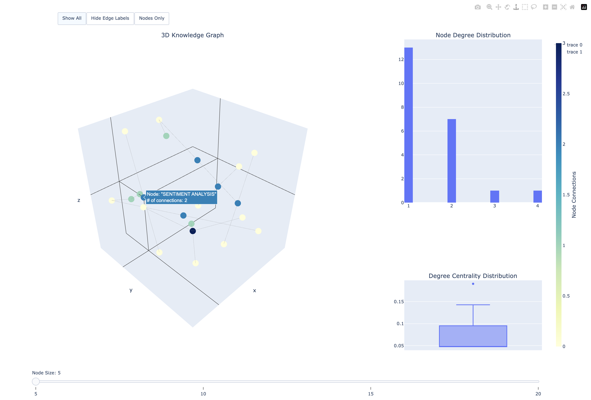
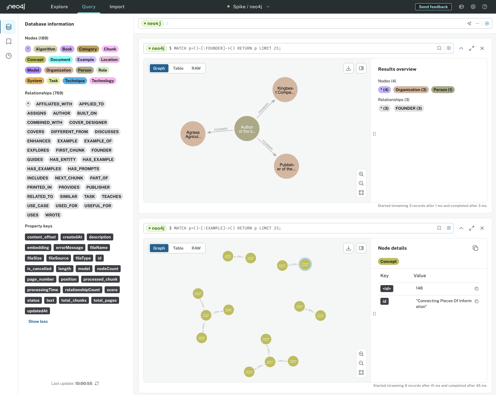
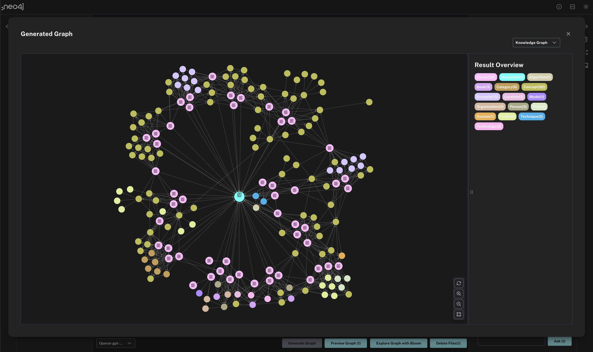

GraphRAG and Knowledge Graph
============================

**GraphRAG** (Graph Retrieval-Augmented Generation) is an advanced approach in natural language processing (NLP) that combines the strengths of graph-based knowledge retrieval with large language models (LLMs) such as GPT-4.

GraphRAG is a structured, hierarchical approach to Retrieval-Augmented Generation (RAG), as opposed to naive semantic-search approaches using plain text snippets. The GraphRAG process involves extracting a knowledge graph out of raw text, building a community hierarchy, generating summaries for these communities, and then leveraging these structures when performing RAG-based tasks.

This technique is particularly useful for reasoning about complex information and private datasets that the LLM has never seen before, such as an enterprise’s proprietary research, business documents, or communications. By using LLM-generated knowledge graphs, GraphRAG provides substantial improvements in question-and-answer performance when conducting document analysis of complex information.

GraphRAG
--------

Running GraphRAG with local LLM.

- Setup

```
$ conda create -n graphrag python=3.11.5
$ conda activate graphrag

$ pip install -r requirements.txt
```

- Initiate

```
$ python -m graphrag.index --init --root ./ragtest
```

- Generate

```
$ python -m graphrag.index --root ./ragtest
🚀 Reading settings from ragtest/settings.yaml
/usr/local/anaconda3/envs/graphrag/lib/python3.11/site-packages/numpy/core/fromnumeric.py:59: FutureWarning: 'DataFrame.swapaxes' is deprecated and will be removed in a future version. Please use
'DataFrame.transpose' instead.
  return bound(*args, **kwds)
🚀 create_base_text_units
                                  id                                              chunk                          chunk_id                        document_ids  n_tokens
0   cf9db84499f9aaa75d58fe4ce8030081  The Art of Asking ChatGPT for High-Quality\n\n...  cf9db84499f9aaa75d58fe4ce8030081  [9f1420926ed2179bef264908d5603d0e]       300
1   5b9e0ad6aff46a679c6ce33a347aae1c  :\n\nChapter 3: Role Prompting\n\nChapter 4: S...  5b9e0ad6aff46a679c6ce33a347aae1c  [9f1420926ed2179bef264908d5603d0e]       300
2   91e6b0e202a0a81a81592f0c00b6f9b9  \n\nChapter 22: Named entity recognition promp...  91e6b0e202a0a81a81592f0c00b6f9b9  [9f1420926ed2179bef264908d5603d0e]       300
3   13f920b58a5dfdd13b8d109c7ce20fa8   language with on-point practical explanations...  13f920b58a5dfdd13b8d109c7ce20fa8  [9f1420926ed2179bef264908d5603d0e]       300
4   57026a3a2ef4aeb0fc9c017468b2b683   the best results from ChatGPT, it is importan...  57026a3a2ef4aeb0fc9c017468b2b683  [9f1420926ed2179bef264908d5603d0e]       300
5   4ede7847c2d336763a2bc385da50e2a6  GPT. We will discuss the\n\ndifferent types of...  4ede7847c2d336763a2bc385da50e2a6  [9f1420926ed2179bef264908d5603d0e]       300
6   06191eae71f9fe543b4562fdd1f01fde   responses to customer inquiries Instructions:...  06191eae71f9fe543b4562fdd1f01fde  [9f1420926ed2179bef264908d5603d0e]       300
7   bac067e13c5935ab6a0b0029292f1e68   for the model to take on. This technique is u...  bac067e13c5935ab6a0b0029292f1e68  [9f1420926ed2179bef264908d5603d0e]       300
8   428baf424d249638321651d825dd9f7b   smartphone Instructions: The description shou...  428baf424d249638321651d825dd9f7b  [9f1420926ed2179bef264908d5603d0e]       300
9   253966b7265a8b2fa741a6e550a5ad67   "\n\nExample:\n\nGenerating a summary o...        253966b7265a8b2fa741a6e550a5ad67  [9f1420926ed2179bef264908d5603d0e]       300
10  41186a60fddae7fc713c03a659b487b8   used to ensure that the review is written fro...  41186a60fddae7fc713c03a659b487b8  [9f1420926ed2179bef264908d5603d0e]       300
11  1a409eca5668ee5d00c9f7b21d8fee2d   and generates text based on its understanding...  1a409eca5668ee5d00c9f7b21d8fee2d  [9f1420926ed2179bef264908d5603d0e]       300
12  c78a7f2ef7f4325ecc29dfb72e66ad5c   that is reflective and contemplative. This te...   c78a7f2ef7f4325ecc29dfb72e66ad5c  [9f1420926ed2179bef264908d5603d0e]       300
13  0b49f354fa0ae099de57ce618c2b25b4   appropriate and coherent text based on the pr...  0b49f354fa0ae099de57ce618c2b25b4  [9f1420926ed2179bef264908d5603d0e]       300
14  b08506fb8686e7fe623ef29a68884597   to the prompt and will continue the conversat...  b08506fb8686e7fe623ef29a68884597  [9f1420926ed2179bef264908d5603d0e]       300
15  12437acdd1cb2fdb9e14897b803c1fc9   consistent with the product information provi...  12437acdd1cb2fdb9e14897b803c1fc9  [9f1420926ed2179bef264908d5603d0e]       300
16  18ca1797c8e8fa27d8c06ce1345972d0   ensure the following text is self-consistent:...  18ca1797c8e8fa27d8c06ce1345972d0  [9f1420926ed2179bef264908d5603d0e]       300
17  6b78ccaf924c66cd93a165b75c37d2d5  -word: "Dragon"\n\nPrompt formula: "Please gen...  6b78ccaf924c66cd93a165b75c37d2d5  [9f1420926ed2179bef264908d5603d0e]       300
18  cd926b2089d6230264d1e0611c34688b  1: Text Generation\n\nTask: Generate a poem\n\...  cd926b2089d6230264d1e0611c34688b  [9f1420926ed2179bef264908d5603d0e]       300
19  0ea45401db2c05c2fa59c4fc9b096dad  marize the following news article in a way tha...  0ea45401db2c05c2fa59c4fc9b096dad  [9f1420926ed2179bef264908d5603d0e]       300
20  b7d3fb89e196e4001a449668bb76a356   Instructions: The generated information shoul...  b7d3fb89e196e4001a449668bb76a356  [9f1420926ed2179bef264908d5603d0e]       300
21  8d3d6a60f05222bb74ee201c5117ed20   information to generate a more comprehensive ...  8d3d6a60f05222bb74ee201c5117ed20  [9f1420926ed2179bef264908d5603d0e]       300
22  85de2c33a283035327c9fe7d433a942a   Updating existing knowledge\n\nTask: Update e...  85de2c33a283035327c9fe7d433a942a  [9f1420926ed2179bef264908d5603d0e]       300
23  f3bff1e108d4f169dd5eead41cb44dbd   Answer a multiple-choice question\n\nInstruct...  f3bff1e108d4f169dd5eead41cb44dbd  [9f1420926ed2179bef264908d5603d0e]       300
24  626c12e1138dc7d71160325227d54085   Interpretable Soft Prompts Interpretable soft...  626c12e1138dc7d71160325227d54085  [9f1420926ed2179bef264908d5603d0e]       300
25  b7119ae91c3f13ec90e23586ebe1002b   the style of a specific period Prompt formula...   b7119ae91c3f13ec90e23586ebe1002b  [9f1420926ed2179bef264908d5603d0e]       300
26  3e70de7b58a0cc5631a367e8e590de9b   style\n\nInstructions: The text should follow...  3e70de7b58a0cc5631a367e8e590de9b  [9f1420926ed2179bef264908d5603d0e]       300
27  6052c145a93aed078e7a721764ec6b15   The definition should be precise Prompt formu...   6052c145a93aed078e7a721764ec6b15  [9f1420926ed2179bef264908d5603d0e]       300
28  e3c5e5a0c555a025a43753a89d149bd8   desired length of the summary and any specifi...   e3c5e5a0c555a025a43753a89d149bd8  [9f1420926ed2179bef264908d5603d0e]       300
29  99780258b112bfd20b76a1347b44c6b7   text that simulates a conversation between tw...  99780258b112bfd20b76a1347b44c6b7  [9f1420926ed2179bef264908d5603d0e]       300
30  43af5e860adc3ae20038f3f3cdcc6368    in the following story [i...                     43af5e860adc3ae20038f3f3cdcc6368  [9f1420926ed2179bef264908d5603d0e]       300
31  5f0cffca2a1653516d9781ca6509b0a8   of text to be generated and any specific requ...   5f0cffca2a1653516d9781ca6509b0a8  [9f1420926ed2179bef264908d5603d0e]       300
32  62cb613c45622430cceee7c3a7e20e27   technique that allows a model to group simila...  62cb613c45622430cceee7c3a7e20e27  [9f1420926ed2179bef264908d5603d0e]       300
33  2b577e8eb3924d16f91547d24fafffb6  : The articles should be grouped based on topi...  2b577e8eb3924d16f91547d24fafffb6  [9f1420926ed2179bef264908d5603d0e]       300
34  36b26ab6e273d4d04f98a89f40e56d02  : Reinforcement learning for text generation T...  36b26ab6e273d4d04f98a89f40e56d02  [9f1420926ed2179bef264908d5603d0e]       300
35  9f3a7ee972d73ea5d806b0bd737a66c2   a model to learn a complex task by first trai...   9f3a7ee972d73ea5d806b0bd737a66c2  [9f1420926ed2179bef264908d5603d0e]       300
36  763dd94aeb3464e38a05409a3932066c   formula: "Use curriculum learning to translat...  763dd94aeb3464e38a05409a3932066c  [9f1420926ed2179bef264908d5603d0e]       300
37  a1610a8ef1ae2af14bc7568532be1b56   their Formula:\n\nExample 1: Sentiment analys...  a1610a8ef1ae2af14bc7568532be1b56  [9f1420926ed2179bef264908d5603d0e]       300
38  8d24257a3fe9a5939a4814c931f74d27   and market research.\n\n\n\n\n\nChapter 22: N...  8d24257a3fe9a5939a4814c931f74d27  [9f1420926ed2179bef264908d5603d0e]       300
39  365b52faa2b1bea8cbccb812db80f8b6   in a legal document Task: Identify and classi...  365b52faa2b1bea8cbccb812db80f8b6  [9f1420926ed2179bef264908d5603d0e]       300
40  e412be4228ed84cc12e53d45377afa55   sentiment or emotion expressed in text.\n\nTh...  e412be4228ed84cc12e53d45377afa55  [9f1420926ed2179bef264908d5603d0e]       300
41  b11b744d1d900a7eb909b8251db01186   Task: Classify news articles into different c...  b11b744d1d900a7eb909b8251db01186  [9f1420926ed2179bef264908d5603d0e]       300
42  d298f622f1b5ef1bd6d53bb5afc6e4ac   all involve generating text, but they differ ...  d298f622f1b5ef1bd6d53bb5afc6e4ac  [9f1420926ed2179bef264908d5603d0e]       300
43  258b1635b1269969561b9e95aaaff370  : Text generation for text completion Task: Co...  258b1635b1269969561b9e95aaaff370  [9f1420926ed2179bef264908d5603d0e]       300
44  209bc758203f8f305ed7a45ebfeb0da5   as Zero, One and Few Shot Prompting, Self-Con...  209bc758203f8f305ed7a45ebfeb0da5  [9f1420926ed2179bef264908d5603d0e]       300
45  d0c7e350d2c1544dc17c19f7ea33793e  : A Complete Guide to Prompt Engineering Techn...  d0c7e350d2c1544dc17c19f7ea33793e  [9f1420926ed2179bef264908d5603d0e]       300
46  13000cfbbf21e01a32d3a24275d6c077   Seed-word Prompt\n\nChapter 9: Knowledge Gene...  13000cfbbf21e01a32d3a24275d6c077  [9f1420926ed2179bef264908d5603d0e]       168
🚀 create_base_extracted_entities
                                        entity_graph
0  <graphml xmlns="http://graphml.graphdrawing.or...
/usr/local/anaconda3/envs/graphrag/lib/python3.11/site-packages/datashaper/engine/verbs/convert.py:65: FutureWarning: errors='ignore' is deprecated and will raise in a future version. Use to_numeric
without passing `errors` and catch exceptions explicitly instead
  column_numeric = cast(pd.Series, pd.to_numeric(column, errors="ignore"))
🚀 create_final_covariates
                                      id human_readable_id covariate_type  ...                      text_unit_id                        document_ids n_tokens
0   355696a3-8315-44a3-8636-ad62645d88e8                 1          claim  ...  cf9db84499f9aaa75d58fe4ce8030081  [9f1420926ed2179bef264908d5603d0e]      300
1   1649d5d4-6d77-44d7-aa1d-2d0df40da74e                 2          claim  ...  5b9e0ad6aff46a679c6ce33a347aae1c  [9f1420926ed2179bef264908d5603d0e]      300
2   d8e2100b-761b-454f-aca4-59162807510c                 3          claim  ...  91e6b0e202a0a81a81592f0c00b6f9b9  [9f1420926ed2179bef264908d5603d0e]      300
3   8983a1b0-072c-4fd7-8c8f-254faa953c10                 4          claim  ...  13f920b58a5dfdd13b8d109c7ce20fa8  [9f1420926ed2179bef264908d5603d0e]      300
4   bbd98a9c-6fb6-4f7a-90a6-f3009de5542d                 5          claim  ...  57026a3a2ef4aeb0fc9c017468b2b683  [9f1420926ed2179bef264908d5603d0e]      300
5   095bfbd4-b714-438a-bb51-6cd7ed93995d                 6          claim  ...  4ede7847c2d336763a2bc385da50e2a6  [9f1420926ed2179bef264908d5603d0e]      300
6   7ab7f876-ab57-49de-99ab-c068600a903c                 7          claim  ...  bac067e13c5935ab6a0b0029292f1e68  [9f1420926ed2179bef264908d5603d0e]      300
7   704b70fe-2189-4fe7-803f-5776d8565bbd                 8          claim  ...  428baf424d249638321651d825dd9f7b  [9f1420926ed2179bef264908d5603d0e]      300
8   8bd65c7e-e518-4533-957d-0bc89ffa89be                 9          claim  ...  1a409eca5668ee5d00c9f7b21d8fee2d  [9f1420926ed2179bef264908d5603d0e]      300
9   2c2083e7-e477-4a7f-a777-23e58ee77c91                10          claim  ...  0b49f354fa0ae099de57ce618c2b25b4  [9f1420926ed2179bef264908d5603d0e]      300
10  6ed85d2b-ec5c-4132-9779-b52d3a492dbd                11          claim  ...  6b78ccaf924c66cd93a165b75c37d2d5  [9f1420926ed2179bef264908d5603d0e]      300
11  625d9577-9f62-4c32-b3e3-ac9c9ff0a08f                12          claim  ...  0ea45401db2c05c2fa59c4fc9b096dad  [9f1420926ed2179bef264908d5603d0e]      300
12  8cf0c849-0300-49b0-8295-c1f64abe6871                13          claim  ...  b7d3fb89e196e4001a449668bb76a356  [9f1420926ed2179bef264908d5603d0e]      300
13  6b923329-b6a2-4c50-aa8d-3c8d524e9140                14          claim  ...  f3bff1e108d4f169dd5eead41cb44dbd  [9f1420926ed2179bef264908d5603d0e]      300
14  68766bb2-8625-4ad9-9876-c232b52fbcad                15          claim  ...  b7119ae91c3f13ec90e23586ebe1002b  [9f1420926ed2179bef264908d5603d0e]      300
15  713ace78-8235-46b4-814a-beecf886f6ae                16          claim  ...  3e70de7b58a0cc5631a367e8e590de9b  [9f1420926ed2179bef264908d5603d0e]      300
16  ff619651-3ffc-4a15-88f0-6387c88166bf                17          claim  ...  6052c145a93aed078e7a721764ec6b15  [9f1420926ed2179bef264908d5603d0e]      300
17  de811b5a-d0a8-445f-8e37-02d71d5e9880                18          claim  ...  99780258b112bfd20b76a1347b44c6b7  [9f1420926ed2179bef264908d5603d0e]      300
18  ff19ebda-5453-4665-b1c2-62f9f3b86d8c                19          claim  ...  43af5e860adc3ae20038f3f3cdcc6368  [9f1420926ed2179bef264908d5603d0e]      300
19  d4549af4-c430-41f3-9147-67e1a0d399fd                20          claim  ...  5f0cffca2a1653516d9781ca6509b0a8  [9f1420926ed2179bef264908d5603d0e]      300
20  78bf5340-826e-429a-be54-e78cb81001ee                21          claim  ...  62cb613c45622430cceee7c3a7e20e27  [9f1420926ed2179bef264908d5603d0e]      300
21  4a2d410d-8a76-4598-8ce7-b6cb065801fb                22          claim  ...  2b577e8eb3924d16f91547d24fafffb6  [9f1420926ed2179bef264908d5603d0e]      300
22  beff7085-2b1d-4064-9c9d-b03044b382dc                23          claim  ...  36b26ab6e273d4d04f98a89f40e56d02  [9f1420926ed2179bef264908d5603d0e]      300
23  4f2a987c-0012-4ac3-a3ce-1a18e6f36961                24          claim  ...  9f3a7ee972d73ea5d806b0bd737a66c2  [9f1420926ed2179bef264908d5603d0e]      300
24  a700b89c-e293-4376-a943-5553ca6bcb86                25          claim  ...  763dd94aeb3464e38a05409a3932066c  [9f1420926ed2179bef264908d5603d0e]      300
25  c16aa4c0-120f-4fba-b5ab-5695edf81854                26          claim  ...  a1610a8ef1ae2af14bc7568532be1b56  [9f1420926ed2179bef264908d5603d0e]      300
26  ec5f423e-0714-4f40-9ff3-2d2a53697074                27          claim  ...  8d24257a3fe9a5939a4814c931f74d27  [9f1420926ed2179bef264908d5603d0e]      300
27  2019b018-a7d6-4d10-8702-e18fd9a1e53c                28          claim  ...  365b52faa2b1bea8cbccb812db80f8b6  [9f1420926ed2179bef264908d5603d0e]      300
28  be77ccc7-0927-47d7-9b30-7f74dda1d915                29          claim  ...  e412be4228ed84cc12e53d45377afa55  [9f1420926ed2179bef264908d5603d0e]      300
29  12b847f7-969b-46fe-94f1-2ccfe4ff92f2                30          claim  ...  b11b744d1d900a7eb909b8251db01186  [9f1420926ed2179bef264908d5603d0e]      300
30  68d1ae17-8210-41c1-8736-421ab24cfb7a                31          claim  ...  d298f622f1b5ef1bd6d53bb5afc6e4ac  [9f1420926ed2179bef264908d5603d0e]      300
31  878dd8a2-fe17-4d38-97b4-21088fd746ba                32          claim  ...  258b1635b1269969561b9e95aaaff370  [9f1420926ed2179bef264908d5603d0e]      300
32  e06046f9-7194-4592-a6d6-e1342fb6cd89                33          claim  ...  209bc758203f8f305ed7a45ebfeb0da5  [9f1420926ed2179bef264908d5603d0e]      300
33  981f3c29-d1b3-437d-8f6a-7f022ca7e3d2                34          claim  ...  209bc758203f8f305ed7a45ebfeb0da5  [9f1420926ed2179bef264908d5603d0e]      300
34  b806dc66-1523-4b14-9a01-187a94564afb                35          claim  ...  209bc758203f8f305ed7a45ebfeb0da5  [9f1420926ed2179bef264908d5603d0e]      300
35  2dd5c35c-8c5b-4f49-baf1-a3683c735eb1                36          claim  ...  d0c7e350d2c1544dc17c19f7ea33793e  [9f1420926ed2179bef264908d5603d0e]      300
36  15ed09a0-3323-448f-92e3-b820118ddffd                37          claim  ...  13000cfbbf21e01a32d3a24275d6c077  [9f1420926ed2179bef264908d5603d0e]      168

[37 rows x 16 columns]
🚀 create_summarized_entities
                                        entity_graph
0  <graphml xmlns="http://graphml.graphdrawing.or...
🚀 join_text_units_to_covariate_ids
                        text_unit_id                                      covariate_ids                                id
0   cf9db84499f9aaa75d58fe4ce8030081             [355696a3-8315-44a3-8636-ad62645d88e8]  cf9db84499f9aaa75d58fe4ce8030081
1   5b9e0ad6aff46a679c6ce33a347aae1c             [1649d5d4-6d77-44d7-aa1d-2d0df40da74e]  5b9e0ad6aff46a679c6ce33a347aae1c
2   91e6b0e202a0a81a81592f0c00b6f9b9               91e6b0e202a0a81a81592f0c00b6f9b9
3   13f920b58a5dfdd13b8d109c7ce20fa8             [8983a1b0-072c-4fd7-8c8f-254faa953c10]  13f920b58a5dfdd13b8d109c7ce20fa8
4   57026a3a2ef4aeb0fc9c017468b2b683               57026a3a2ef4aeb0fc9c017468b2b683
5   4ede7847c2d336763a2bc385da50e2a6             [095bfbd4-b714-438a-bb51-6cd7ed93995d]  4ede7847c2d336763a2bc385da50e2a6
6   bac067e13c5935ab6a0b0029292f1e68             [7ab7f876-ab57-49de-99ab-c068600a903c]  bac067e13c5935ab6a0b0029292f1e68
7   428baf424d249638321651d825dd9f7b             [704b70fe-2189-4fe7-803f-5776d8565bbd]  428baf424d249638321651d825dd9f7b
8   1a409eca5668ee5d00c9f7b21d8fee2d             [8bd65c7e-e518-4533-957d-0bc89ffa89be]  1a409eca5668ee5d00c9f7b21d8fee2d
9   0b49f354fa0ae099de57ce618c2b25b4             [2c2083e7-e477-4a7f-a777-23e58ee77c91]  0b49f354fa0ae099de57ce618c2b25b4
10  6b78ccaf924c66cd93a165b75c37d2d5             [6ed85d2b-ec5c-4132-9779-b52d3a492dbd]  6b78ccaf924c66cd93a165b75c37d2d5
11  0ea45401db2c05c2fa59c4fc9b096dad             [625d9577-9f62-4c32-b3e3-ac9c9ff0a08f]  0ea45401db2c05c2fa59c4fc9b096dad
12  b7d3fb89e196e4001a449668bb76a356             [8cf0c849-0300-49b0-8295-c1f64abe6871]  b7d3fb89e196e4001a449668bb76a356
13  f3bff1e108d4f169dd5eead41cb44dbd             [6b923329-b6a2-4c50-aa8d-3c8d524e9140]  f3bff1e108d4f169dd5eead41cb44dbd
14  b7119ae91c3f13ec90e23586ebe1002b             [68766bb2-8625-4ad9-9876-c232b52fbcad]  b7119ae91c3f13ec90e23586ebe1002b
15  3e70de7b58a0cc5631a367e8e590de9b             [713ace78-8235-46b4-814a-beecf886f6ae]  3e70de7b58a0cc5631a367e8e590de9b
16  6052c145a93aed078e7a721764ec6b15               6052c145a93aed078e7a721764ec6b15
17  99780258b112bfd20b76a1347b44c6b7               99780258b112bfd20b76a1347b44c6b7
18  43af5e860adc3ae20038f3f3cdcc6368               43af5e860adc3ae20038f3f3cdcc6368
19  5f0cffca2a1653516d9781ca6509b0a8               5f0cffca2a1653516d9781ca6509b0a8
20  62cb613c45622430cceee7c3a7e20e27             [78bf5340-826e-429a-be54-e78cb81001ee]  62cb613c45622430cceee7c3a7e20e27
21  2b577e8eb3924d16f91547d24fafffb6             [4a2d410d-8a76-4598-8ce7-b6cb065801fb]  2b577e8eb3924d16f91547d24fafffb6
22  36b26ab6e273d4d04f98a89f40e56d02               36b26ab6e273d4d04f98a89f40e56d02
23  9f3a7ee972d73ea5d806b0bd737a66c2             [4f2a987c-0012-4ac3-a3ce-1a18e6f36961]  9f3a7ee972d73ea5d806b0bd737a66c2
24  763dd94aeb3464e38a05409a3932066c               763dd94aeb3464e38a05409a3932066c
25  a1610a8ef1ae2af14bc7568532be1b56               a1610a8ef1ae2af14bc7568532be1b56
26  8d24257a3fe9a5939a4814c931f74d27               8d24257a3fe9a5939a4814c931f74d27
27  365b52faa2b1bea8cbccb812db80f8b6             [2019b018-a7d6-4d10-8702-e18fd9a1e53c]  365b52faa2b1bea8cbccb812db80f8b6
28  e412be4228ed84cc12e53d45377afa55               e412be4228ed84cc12e53d45377afa55
29  b11b744d1d900a7eb909b8251db01186             [12b847f7-969b-46fe-94f1-2ccfe4ff92f2]  b11b744d1d900a7eb909b8251db01186
30  d298f622f1b5ef1bd6d53bb5afc6e4ac             [68d1ae17-8210-41c1-8736-421ab24cfb7a]  d298f622f1b5ef1bd6d53bb5afc6e4ac
31  258b1635b1269969561b9e95aaaff370             [878dd8a2-fe17-4d38-97b4-21088fd746ba]  258b1635b1269969561b9e95aaaff370
32  209bc758203f8f305ed7a45ebfeb0da5  [e06046f9-7194-4592-a6d6-e1342fb6cd89, 981f3c2...  209bc758203f8f305ed7a45ebfeb0da5
33  d0c7e350d2c1544dc17c19f7ea33793e             [2dd5c35c-8c5b-4f49-baf1-a3683c735eb1]  d0c7e350d2c1544dc17c19f7ea33793e
34  13000cfbbf21e01a32d3a24275d6c077             [15ed09a0-3323-448f-92e3-b820118ddffd]  13000cfbbf21e01a32d3a24275d6c077
🚀 create_base_entity_graph
   level                                    clustered_graph
0      0  <graphml xmlns="http://graphml.graphdrawing.or...
/usr/local/anaconda3/envs/graphrag/lib/python3.11/site-packages/numpy/core/fromnumeric.py:59: FutureWarning: 'DataFrame.swapaxes' is deprecated and will be removed in a future version. Please use
'DataFrame.transpose' instead.
  return bound(*args, **kwds)
/usr/local/anaconda3/envs/graphrag/lib/python3.11/site-packages/numpy/core/fromnumeric.py:59: FutureWarning: 'DataFrame.swapaxes' is deprecated and will be removed in a future version. Please use
'DataFrame.transpose' instead.
  return bound(*args, **kwds)
🚀 create_final_entities
                                  id                                               name  ...                                      text_unit_ids                              description_embedding
0   b45241d70f0e43fca764df95b2b81f77                                     "IBRAHIM JOHN"  ...  [209bc758203f8f305ed7a45ebfeb0da5, cf9db84499f...  [-0.008021206595003605, 0.010125916451215744, ...
1   4119fd06010c494caa07f439b333f4c5                      "NZUNDA TECHNOLOGIES LIMITED"  ...  [209bc758203f8f305ed7a45ebfeb0da5, cf9db84499f...  [-0.020000364631414413, -0.0014000904047861695...
2   d3835bf3dda84ead99deadbeac5d0d7d                                      "ART PAINTER"  ...  [0.003571996698155999, -0.012489045970141888, ...
3   077d2820ae1845bcbb1803379a3d1eae                         "UNITED STATES OF AMERICA"  ...  [-0.031287893652915955, 0.005283992737531662, ...
4   3671ea0dd4e84c1a9b02c5ab2c8f4bac  "THE ART OF ASKING CHATGPT FOR HIGH-QUALITY AN...  ...                 [91e6b0e202a0a81a81592f0c00b6f9b9]  [-0.0038434218149632215, 0.01302752923220396, ...
..                               ...                                                ...  ...                                                ...                                                ...
75  ed6d2eee9d7b4f5db466b1f6404d31cc                                 "DIALOGUE PROMPTS"  ...                 [13000cfbbf21e01a32d3a24275d6c077]  [-0.02031073532998562, 0.008854231797158718, 0...
76  fc01e9baa80e417c9206f941bb279407                      "CURRICULUM LEARNING PROMPTS"  ...                 [13000cfbbf21e01a32d3a24275d6c077]  [-0.00589411985129118, -0.004804066848009825, ...
77  56d0e5ebe79e4814bd1463cf6ca21394                       "SENTIMENT ANALYSIS PROMPTS"  ...                 [13000cfbbf21e01a32d3a24275d6c077]  [0.02289656177163124, 0.014859766699373722, 0....
78  7c49f2710e8b4d3b8dc9310834406ea5                 "NAMED ENTITY RECOGNITION PROMPTS"  ...                 [13000cfbbf21e01a32d3a24275d6c077]  [0.006014593411237001, 0.008057049475610256, 0...
79  c6d1e4f56c2843e89cf0b91c10bb6de2                      "TEXT CLASSIFICATION PROMPTS"  ...                 [13000cfbbf21e01a32d3a24275d6c077]  [-0.031813766807317734, 0.018307922407984734, ...

[80 rows x 8 columns]
/usr/local/anaconda3/envs/graphrag/lib/python3.11/site-packages/numpy/core/fromnumeric.py:59: FutureWarning: 'DataFrame.swapaxes' is deprecated and will be removed in a future version. Please use
'DataFrame.transpose' instead.
  return bound(*args, **kwds)
/usr/local/anaconda3/envs/graphrag/lib/python3.11/site-packages/datashaper/engine/verbs/convert.py:72: FutureWarning: errors='ignore' is deprecated and will raise in a future version. Use to_datetime
without passing `errors` and catch exceptions explicitly instead
  datetime_column = pd.to_datetime(column, errors="ignore")
/usr/local/anaconda3/envs/graphrag/lib/python3.11/site-packages/datashaper/engine/verbs/convert.py:72: UserWarning: Could not infer format, so each element will be parsed individually, falling back to
`dateutil`. To ensure parsing is consistent and as-expected, please specify a format.
  datetime_column = pd.to_datetime(column, errors="ignore")
🚀 create_final_nodes
    level                                              title            type                                        description  ... community                 top_level_node_id  x  y
0       0                                     "IBRAHIM JOHN"        "PERSON"  Ibrahim John is the author of 'The Art of Aski...  ...       NaN  b45241d70f0e43fca764df95b2b81f77  0  0
1       0                      "NZUNDA TECHNOLOGIES LIMITED"  "ORGANIZATION"  Nzunda Technologies Limited, one of the three ...  ...       NaN  4119fd06010c494caa07f439b333f4c5  0  0
2       0                                      "ART PAINTER"        "PERSON"  "Art Painter is credited with the cover design...  ...       NaN  d3835bf3dda84ead99deadbeac5d0d7d  0  0
3       0                         "UNITED STATES OF AMERICA"           "GEO"  "The book 'The Art of Asking ChatGPT for High-...  ...       NaN  077d2820ae1845bcbb1803379a3d1eae  0  0
4       0  "THE ART OF ASKING CHATGPT FOR HIGH-QUALITY AN...  "ORGANIZATION"  "This book is a comprehensive guide to underst...  ...       NaN  3671ea0dd4e84c1a9b02c5ab2c8f4bac  0  0
..    ...                                                ...             ...                                                ...  ...       ...                               ... .. ..
75      0                                 "DIALOGUE PROMPTS"         "EVENT"  "Dialogue Prompts are used to facilitate or ge...  ...       NaN  ed6d2eee9d7b4f5db466b1f6404d31cc  0  0
76      0                      "CURRICULUM LEARNING PROMPTS"         "EVENT"  "Curriculum Learning Prompts refer to a struct...  ...       NaN  fc01e9baa80e417c9206f941bb279407  0  0
77      0                       "SENTIMENT ANALYSIS PROMPTS"         "EVENT"  "Sentiment Analysis Prompts are used to guide ...  ...       NaN  56d0e5ebe79e4814bd1463cf6ca21394  0  0
78      0                 "NAMED ENTITY RECOGNITION PROMPTS"         "EVENT"  "Named Entity Recognition Prompts are designed...  ...       NaN  7c49f2710e8b4d3b8dc9310834406ea5  0  0
79      0                      "TEXT CLASSIFICATION PROMPTS"         "EVENT"  "Text Classification Prompts instruct ChatGPT ...   ...       NaN  c6d1e4f56c2843e89cf0b91c10bb6de2  0  0

[80 rows x 14 columns]
/usr/local/anaconda3/envs/graphrag/lib/python3.11/site-packages/numpy/core/fromnumeric.py:59: FutureWarning: 'DataFrame.swapaxes' is deprecated and will be removed in a future version. Please use
'DataFrame.transpose' instead.
  return bound(*args, **kwds)
/usr/local/anaconda3/envs/graphrag/lib/python3.11/site-packages/numpy/core/fromnumeric.py:59: FutureWarning: 'DataFrame.swapaxes' is deprecated and will be removed in a future version. Please use
'DataFrame.transpose' instead.
  return bound(*args, **kwds)
🚀 create_final_communities
  id        title  level raw_community                                   relationship_ids                                      text_unit_ids
0  4  Community 4      0             4  [e22d1d1cd8d14f12b81828d940f40d70, 9ab48505fb1...  [13000cfbbf21e01a32d3a24275d6c077,258b1635b126...
1  3  Community 3      0             3  [36084a9fab53433493f079e97e68bf65, eebcc7ec8e3...  [13000cfbbf21e01a32d3a24275d6c077,626c12e1138d...
2  1  Community 1      0             1  [fd9cb733b28d420cb5cef01e545a132c, 0fbcca3f17c...  [365b52faa2b1bea8cbccb812db80f8b6,763dd94aeb34...
3  0  Community 0      0             0  [bbf148ae4d48422f8fdef754cfa2b9e4, cec95bf17e7...  [13000cfbbf21e01a32d3a24275d6c077,3e70de7b58a0...
4  2  Community 2      0             2  [d136b08d586d488f9e4188b524c85a29, af1d0fec221...  [62cb613c45622430cceee7c3a7e20e27,b11b744d1d90...
🚀 join_text_units_to_entity_ids
                       text_unit_ids                                         entity_ids                                id
0   209bc758203f8f305ed7a45ebfeb0da5  [b45241d70f0e43fca764df95b2b81f77, 4119fd06010...  209bc758203f8f305ed7a45ebfeb0da5
1   cf9db84499f9aaa75d58fe4ce8030081  [b45241d70f0e43fca764df95b2b81f77, 4119fd06010...  cf9db84499f9aaa75d58fe4ce8030081
2   d0c7e350d2c1544dc17c19f7ea33793e  [4119fd06010c494caa07f439b333f4c5, 26f88ab3e2e...  d0c7e350d2c1544dc17c19f7ea33793e
3   91e6b0e202a0a81a81592f0c00b6f9b9  [3671ea0dd4e84c1a9b02c5ab2c8f4bac, 19a7f254a5d...  91e6b0e202a0a81a81592f0c00b6f9b9
4   13000cfbbf21e01a32d3a24275d6c077  [19a7f254a5d64566ab5cc15472df02de, 273daeec8ca...  13000cfbbf21e01a32d3a24275d6c077
5   258b1635b1269969561b9e95aaaff370  [19a7f254a5d64566ab5cc15472df02de, 48c0c4d72da...  258b1635b1269969561b9e95aaaff370
6   2b577e8eb3924d16f91547d24fafffb6  [19a7f254a5d64566ab5cc15472df02de, bf4e255cdac...  2b577e8eb3924d16f91547d24fafffb6
7   6052c145a93aed078e7a721764ec6b15  [19a7f254a5d64566ab5cc15472df02de, 1c109cfdc37...  6052c145a93aed078e7a721764ec6b15
8   62cb613c45622430cceee7c3a7e20e27  [19a7f254a5d64566ab5cc15472df02de, 17ed1d92075...  62cb613c45622430cceee7c3a7e20e27
9   763dd94aeb3464e38a05409a3932066c  [19a7f254a5d64566ab5cc15472df02de, deece7e64b2...  763dd94aeb3464e38a05409a3932066c
10  8d24257a3fe9a5939a4814c931f74d27  [19a7f254a5d64566ab5cc15472df02de, ef32c4b208d...  8d24257a3fe9a5939a4814c931f74d27
11  9f3a7ee972d73ea5d806b0bd737a66c2  [19a7f254a5d64566ab5cc15472df02de, f1c6eed066f...  9f3a7ee972d73ea5d806b0bd737a66c2
12  d298f622f1b5ef1bd6d53bb5afc6e4ac  [19a7f254a5d64566ab5cc15472df02de, bf4e255cdac...  d298f622f1b5ef1bd6d53bb5afc6e4ac
13  428baf424d249638321651d825dd9f7b  [f7e11b0e297a44a896dc67928368f600, 1fd3fa8bb5a...  428baf424d249638321651d825dd9f7b
14  0b49f354fa0ae099de57ce618c2b25b4  [e1fd0e904a53409aada44442f23a51cb, de988724cfd...  0b49f354fa0ae099de57ce618c2b25b4
15  18ca1797c8e8fa27d8c06ce1345972d0  [4a67211867e5464ba45126315a122a8a, 04dbbb2283b...  18ca1797c8e8fa27d8c06ce1345972d0
16  626c12e1138dc7d71160325227d54085  [273daeec8cad41e6b3e450447db58ee7, e69dc259edb...  626c12e1138dc7d71160325227d54085
17  f3bff1e108d4f169dd5eead41cb44dbd  [273daeec8cad41e6b3e450447db58ee7, e69dc259edb...  f3bff1e108d4f169dd5eead41cb44dbd
18  365b52faa2b1bea8cbccb812db80f8b6  [deece7e64b2a4628850d4bb6e394a9c3, b785a902506...  365b52faa2b1bea8cbccb812db80f8b6
19  a1610a8ef1ae2af14bc7568532be1b56  [deece7e64b2a4628850d4bb6e394a9c3, 17ed1d92075...  a1610a8ef1ae2af14bc7568532be1b56
20  e412be4228ed84cc12e53d45377afa55  [deece7e64b2a4628850d4bb6e394a9c3, 17ed1d92075...  e412be4228ed84cc12e53d45377afa55
21  3e70de7b58a0cc5631a367e8e590de9b  [e657b5121ff8456b9a610cfaead8e0cb, 3d6b216c143...  3e70de7b58a0cc5631a367e8e590de9b
22  36b26ab6e273d4d04f98a89f40e56d02  [bf4e255cdac94ccc83a56435a5e4b075, 32ee140946e...  36b26ab6e273d4d04f98a89f40e56d02
23  99780258b112bfd20b76a1347b44c6b7  [68105770b523412388424d984e711917, 85c79fd84f5...  99780258b112bfd20b76a1347b44c6b7
24  43af5e860adc3ae20038f3f3cdcc6368  [eae4259b19a741ab9f9f6af18c4a0470, 3138f39f2bc...  43af5e860adc3ae20038f3f3cdcc6368
25  5f0cffca2a1653516d9781ca6509b0a8  [dde131ab575d44dbb55289a6972be18f, de9e343f2e3...  5f0cffca2a1653516d9781ca6509b0a8
26  b11b744d1d900a7eb909b8251db01186  [3ce7c210a21b4deebad7cc9308148d86, 3b6cd96a273...  b11b744d1d900a7eb909b8251db01186
/usr/local/anaconda3/envs/graphrag/lib/python3.11/site-packages/numpy/core/fromnumeric.py:59: FutureWarning: 'DataFrame.swapaxes' is deprecated and will be removed in a future version. Please use
'DataFrame.transpose' instead.
  return bound(*args, **kwds)
/usr/local/anaconda3/envs/graphrag/lib/python3.11/site-packages/numpy/core/fromnumeric.py:59: FutureWarning: 'DataFrame.swapaxes' is deprecated and will be removed in a future version. Please use
'DataFrame.transpose' instead.
  return bound(*args, **kwds)
/usr/local/anaconda3/envs/graphrag/lib/python3.11/site-packages/datashaper/engine/verbs/convert.py:65: FutureWarning: errors='ignore' is deprecated and will raise in a future version. Use to_numeric
without passing `errors` and catch exceptions explicitly instead
  column_numeric = cast(pd.Series, pd.to_numeric(column, errors="ignore"))
🚀 create_final_relationships
                             source                                 target  weight                                        description  ... human_readable_id source_degree target_degree  rank
0                    "IBRAHIM JOHN"          "NZUNDA TECHNOLOGIES LIMITED"     2.0  Ibrahim John, the founder of Nzunda Technologi...  ...                 0             5             3     8
1                    "IBRAHIM JOHN"                          "ART PAINTER"     1.0  "Art Painter designed the cover for Ibrahim Jo...  ...                 1             5             1     6
2                    "IBRAHIM JOHN"                             "TANZANIA"     1.0  "Ibrahim John was born in Tanzania, which is s...  ...                 2             5             2     7
3                    "IBRAHIM JOHN"             "KINGBEST COMPANY LIMITED"     1.0  "Ibrahim John is the founder of Kingbest Compa...  ...                 3             5             2     7
4                    "IBRAHIM JOHN"           "AGRASA AGRICULTURE LIMITED"     1.0  "Ibrahim John is the founder of Agrasa Agricul...  ...                 4             5             2     7
5     "NZUNDA TECHNOLOGIES LIMITED"             "UNITED STATES OF AMERICA"     1.0  "Nzunda Technologies Limited published a book ...  ...                 5             3             1     4
6     "NZUNDA TECHNOLOGIES LIMITED"                              "IBRAHIM"     1.0  "Ibrahim is the founder of Nzunda Technologies...  ...                 6             3             4     7
7                         "CHATGPT"                "INFORMATION RETRIEVAL"     1.0  "Information Retrieval tasks can be executed b...  ...                 7            12             1    13
8                         "CHATGPT"                "SUMMARIZATION PROMPTS"     1.0  "Summarization Prompts are applied using ChatG...  ...                 8            12             2    14
9                         "CHATGPT"                     "CUSTOMER REVIEWS"     1.0  "ChatGPT is used to group customer reviews int...  ...                 9            12             3    15
10                        "CHATGPT"                        "NEWS ARTICLES"     1.0  "ChatGPT is applied to group news articles int...  ...                10            12             2    14
11                        "CHATGPT"                    "SCIENTIFIC PAPERS"     1.0  "ChatGPT facilitates the grouping of scientifi...   ...                11            12             1    13
12                        "CHATGPT"       "REINFORCEMENT LEARNING PROMPTS"     1.0  "Reinforcement learning prompts are applied us...  ...                12            12             1    13
13                        "CHATGPT"                      "TEXT GENERATION"     2.0  ChatGPT is a sophisticated tool designed to sh...  ...                13            12             4    16
14                        "CHATGPT"                 "LANGUAGE TRANSLATION"     1.0  "ChatGPT applies reinforcement learning prompt...  ...                14            12             2    14
15                        "CHATGPT"                  "CURRICULUM LEARNING"     2.0  Curriculum Learning is a technique employed in...  ...                15            12             5    17
16                        "CHATGPT"                   "SENTIMENT ANALYSIS"     1.0  "Sentiment Analysis is a task ChatGPT is instr...  ...                16            12             5    17
17                        "CHATGPT"                   "PROMPT ENGINEERING"     1.0  "Prompt Engineering is a technique used to opt...  ...                17            12             1    13
18                        "CHATGPT"  "CHAPTER 26: WORD PREDICTION PROMPTS"     1.0  "Chapter 26 discusses techniques relevant to i...  ...                18            12             1    13
19                     "SMARTPHONE"             "MARKETING REPRESENTATIVE"     1.0  "The Marketing Representative creates a compel...  ...                19             2             1     3
20                     "SMARTPHONE"                           "INNOVATIVE"     1.0  "The smartphone is described using the seed-wo...  ...                20             2             1     3
21                 "CLIMATE CHANGE"                          "AGRICULTURE"     1.0  "Climate Change directly impacts Agriculture b...  ...                21             1             1     2
22   "ARTIFICIAL INTELLIGENCE (AI)"                           "HEALTHCARE"     1.0  "AI impacts Healthcare by providing tools for ...  ...                22             2             1     3
23   "ARTIFICIAL INTELLIGENCE (AI)"                              "FINANCE"     1.0  "AI influences Finance through algorithms for ...   ...                23             2             1     3
24                    "REMOTE WORK"                          "FLEXIBILITY"     1.0  "Remote Work offers Flexibility as one of its ...  ...                24             2             1     3
25                    "REMOTE WORK"                            "ISOLATION"     1.0  "One of the drawbacks of Remote Work is Isolat...  ...                25             2             1     3
26     "INTERPRETABLE SOFT PROMPTS"                      "TEXT GENERATION"     1.0  "Interpretable Soft Prompts technique is used ...  ...                26             3             4     7
27     "INTERPRETABLE SOFT PROMPTS"                      "TEXT COMPLETION"     1.0  "Interpretable Soft Prompts technique is appli...  ...                27             3             2     5
28     "INTERPRETABLE SOFT PROMPTS"                    "LANGUAGE MODELING"     1.0  "Interpretable Soft Prompts technique facilita...  ...                28             3             2     5
29                "TEXT COMPLETION"        "CONTROLLED GENERATION PROMPTS"     1.0  "Controlled Generation Prompts provide a frame...  ...                29             2             4     6
30             "SENTIMENT ANALYSIS"                     "CUSTOMER REVIEWS"     2.0  Sentiment Analysis is a technique applied to C...  ...                30             5             3     8
31             "SENTIMENT ANALYSIS"                               "TWEETS"     1.0  "Sentiment Analysis is used to determine the s...  ...                31             5             1     6
32             "SENTIMENT ANALYSIS"                      "PRODUCT REVIEWS"     1.0  "Sentiment Analysis is conducted on Product Re...  ...                32             5             1     6
33             "SENTIMENT ANALYSIS"          "NATURAL LANGUAGE PROCESSING"     1.0  "Sentiment Analysis is a task within the field...   ...                33             5             3     8
34  "CONTROLLED GENERATION PROMPTS"                      "TEXT GENERATION"     1.0  "Controlled Generation Prompts are used to gen...  ...                34             4             4     8
35  "CONTROLLED GENERATION PROMPTS"                    "LANGUAGE MODELING"     1.0  "Controlled Generation Prompts support Languag...  ...                35             4             2     6
36  "CONTROLLED GENERATION PROMPTS"           "QUESTION-ANSWERING PROMPTS"     1.0  "Controlled Generation Prompts provide a struc...  ...                36             4             2     6
37                "TEXT GENERATION"               "REINFORCEMENT LEARNING"     1.0  "Reinforcement Learning is applied in the task...  ...                37             4             4     8
38     "QUESTION-ANSWERING PROMPTS"                "SUMMARIZATION PROMPTS"     1.0  "Both Question-Answering Prompts and Summariza...  ...                38             2             2     4
39            "DIALOGUE GENERATION"                        "STORY WRITING"     1.0  "Dialogue Generation is a component of Story W...  ...                39             2             1     3
40            "DIALOGUE GENERATION"                  "CHATBOT DEVELOPMENT"     1.0  "Dialogue Generation techniques are applied in...  ...                40             2             2     4
41            "CHATBOT DEVELOPMENT"                  "ADVERSARIAL PROMPTS"     2.0  In the process of Chatbot Development, Adversa...  ...                41             2             1     3
42               "CUSTOMER REVIEWS"                  "TEXT CLASSIFICATION"     1.0  "Text Classification is used to categorize Cus...   ...                42             3             4     7
43                  "NEWS ARTICLES"                  "TEXT CLASSIFICATION"     2.0  Text Classification is applied to News Article...   ...                43             2             4     6
44           "LANGUAGE TRANSLATION"               "REINFORCEMENT LEARNING"     1.0  "Reinforcement Learning is used in the task of...  ...                44             2             4     6
45         "REINFORCEMENT LEARNING"                   "QUESTION ANSWERING"     1.0  "Reinforcement Learning is utilized in the tas...  ...                45             4             1     5
46         "REINFORCEMENT LEARNING"                  "CURRICULUM LEARNING"     1.0  "Curriculum Learning techniques can be applied...  ...                46             4             5     9
47            "CURRICULUM LEARNING"          "NATURAL LANGUAGE PROCESSING"     1.0  "Curriculum Learning is applied in the field o...   ...                47             5             3     8
48            "CURRICULUM LEARNING"                    "IMAGE RECOGNITION"     1.0  "Curriculum Learning techniques are utilized i...  ...                48             5             1     6
49            "CURRICULUM LEARNING"                     "MACHINE LEARNING"     1.0  "Curriculum Learning is a method used within M...  ...                49             5             1     6
50    "NATURAL LANGUAGE PROCESSING"       "NAMED ENTITY RECOGNITION (NER)"     1.0  "Named Entity Recognition (NER) is a technique...  ...                50             3             1     4
51            "TEXT CLASSIFICATION"                               "EMAILS"     2.0  Text Classification is employed to organize Em...   ...                51             4             1     5
52            "TEXT CLASSIFICATION"              "TEXT GENERATION PROMPTS"     1.0  "Text Generation Prompts and Text Classificati...   ...                52             4             1     5
53                      "CHAPTER 2"                  "INSTRUCTION PROMPTS"     1.0  "Chapter 2 is dedicated to the exploration and...  ...                53             1             1     2
54                      "CHAPTER 3"                         "ROLE PROMPTS"     1.0  "Chapter 3 examines the use of role prompts to...  ...                54             1             1     2
55                      "CHAPTER 4"                     "STANDARD PROMPTS"     1.0  "Chapter 4 evaluates how standard prompts can ...  ...                55             1             1     2
56                       "TANZANIA"                              "IBRAHIM"     1.0  "Ibrahim was born in Tanzania, making the coun...  ...                56             2             4     6
57       "KINGBEST COMPANY LIMITED"                              "IBRAHIM"     1.0  "Ibrahim's founding of Kingbest Company Limite...  ...                57             2             4     6
58     "AGRASA AGRICULTURE LIMITED"                              "IBRAHIM"     1.0  "Ibrahim's establishment of Agrasa Agriculture...  ...                58             2             4     6

[59 rows x 10 columns]
🚀 join_text_units_to_relationship_ids
                                  id                                   relationship_ids
0   209bc758203f8f305ed7a45ebfeb0da5  [0adb2d9941f34ef7b2f7743cc6225844, 36a4fcd8efc...
1   cf9db84499f9aaa75d58fe4ce8030081  [0adb2d9941f34ef7b2f7743cc6225844, 6b02373137f...
2   d0c7e350d2c1544dc17c19f7ea33793e  [8d141c0b80f74b79a05eed7fe161fe49, a671bf7fea2...
3   6052c145a93aed078e7a721764ec6b15  [e22d1d1cd8d14f12b81828d940f40d70, 9ab48505fb1...
4   62cb613c45622430cceee7c3a7e20e27  [148fffeb994541b2b4b6dcefda7001a8, 89c08e79329...
5   2b577e8eb3924d16f91547d24fafffb6  [43c3390303c6476cb65f584e37c3e81c, fa14b16c17e...
6   d298f622f1b5ef1bd6d53bb5afc6e4ac  [fa14b16c17e3417dba5a4b473ea5b18d, 3c063eea52e...
7   763dd94aeb3464e38a05409a3932066c  [bef16fb5fd7344cca5e295b13ef3e0cd, bb9e01bc171...
8   9f3a7ee972d73ea5d806b0bd737a66c2  [bef16fb5fd7344cca5e295b13ef3e0cd, aff21f1da16...
9   258b1635b1269969561b9e95aaaff370  [252cc8452bfc4c2aa58cab68d8b61879, 8870cf2b5df...
10  428baf424d249638321651d825dd9f7b  [7e2c84548fb94ee395ba8588d8f2a006, f034618dde7...
11  0b49f354fa0ae099de57ce618c2b25b4  [5c41f96be13e49dba649454297834546, 7ea4afbf8a2...
12  626c12e1138dc7d71160325227d54085  [36084a9fab53433493f079e97e68bf65, eebcc7ec8e3...
13  a1610a8ef1ae2af14bc7568532be1b56  [fd9cb733b28d420cb5cef01e545a132c, 0fbcca3f17c...
14  e412be4228ed84cc12e53d45377afa55  [fd9cb733b28d420cb5cef01e545a132c, 6ea81acaf23...
15  3e70de7b58a0cc5631a367e8e590de9b  [cec95bf17e7e4c939b56c9c6f402a29f, bbf148ae4d4...
16  36b26ab6e273d4d04f98a89f40e56d02  [599164aead034bc19446efacc77554d2, cccfa151fed...
17  99780258b112bfd20b76a1347b44c6b7  [de61b2670999433f807a6a1dc2b81e43, 3e95dacfe57...
18  43af5e860adc3ae20038f3f3cdcc6368                 [1f1545308e9347af91fd03b94aadc21f]
19  b11b744d1d900a7eb909b8251db01186  [d136b08d586d488f9e4188b524c85a29, af1d0fec221...
🚀 create_final_community_reports
  community                                       full_content  ...                                  full_content_json                                    id
0         0  # ChatGPT and Prompt-Based Text Generation Tec...  ...  {\n    "title": "ChatGPT and Prompt-Based Text...  6071386c-cd01-47e2-a333-cffdd593dc2e
1         1  # Sentiment Analysis in NLP and Customer Engag...  ...  {\n    "title": "Sentiment Analysis in NLP and...  39c5f8cc-43d2-49d5-9d56-bd73c5db3318
2         2  # Text Classification and Its Applications\n\n...   ...  {\n    "title": "Text Classification and Its A...   cc7dc578-1de9-487b-8351-d7d09524a1b9
3         3  # Advancements in AI Text Generation and Learn...  ...  {\n    "title": "Advancements in AI Text Gener...  1c1ce97d-956f-4a81-b00b-ee13a476f5c7
4         4  # ChatGPT and Curriculum Learning in AI Develo...  ...  {\n    "title": "ChatGPT and Curriculum Learni...  0e88cdf9-d3eb-40db-a17b-ec034c282228

[5 rows x 10 columns]
🚀 create_final_text_units
                                  id                                               text  ...                                   relationship_ids                                      covariate_ids
0   cf9db84499f9aaa75d58fe4ce8030081  The Art of Asking ChatGPT for High-Quality\n\n...  ...  [0adb2d9941f34ef7b2f7743cc6225844, 6b02373137f...             [355696a3-8315-44a3-8636-ad62645d88e8]
1   428baf424d249638321651d825dd9f7b   smartphone Instructions: The description shou...  ...  [7e2c84548fb94ee395ba8588d8f2a006, f034618dde7...             [704b70fe-2189-4fe7-803f-5776d8565bbd]
2   0b49f354fa0ae099de57ce618c2b25b4   appropriate and coherent text based on the pr...  ...  [5c41f96be13e49dba649454297834546, 7ea4afbf8a2...             [2c2083e7-e477-4a7f-a777-23e58ee77c91]
3   3e70de7b58a0cc5631a367e8e590de9b   style\n\nInstructions: The text should follow...  ...  [cec95bf17e7e4c939b56c9c6f402a29f, bbf148ae4d4...             [713ace78-8235-46b4-814a-beecf886f6ae]
4   6052c145a93aed078e7a721764ec6b15   The definition should be precise Prompt formu...   ...  [e22d1d1cd8d14f12b81828d940f40d70, 9ab48505fb1...
5   99780258b112bfd20b76a1347b44c6b7   text that simulates a conversation between tw...  ...  [de61b2670999433f807a6a1dc2b81e43, 3e95dacfe57...
6   43af5e860adc3ae20038f3f3cdcc6368    in the following story [i                        ...                                                ...                 [1f1545308e9347af91fd03b94aadc21f]
7   62cb613c45622430cceee7c3a7e20e27   technique that allows a model to group simila...  ...  [148fffeb994541b2b4b6dcefda7001a8, 89c08e79329...             [78bf5340-826e-429a-be54-e78cb81001ee]
8   2b577e8eb3924d16f91547d24fafffb6  : The articles should be grouped based on topi...  ...  [43c3390303c6476cb65f584e37c3e81c, fa14b16c17e...             [4a2d410d-8a76-4598-8ce7-b6cb065801fb]
9   36b26ab6e273d4d04f98a89f40e56d02  : Reinforcement learning for text generation T...  ...  [599164aead034bc19446efacc77554d2, cccfa151fed...
10  9f3a7ee972d73ea5d806b0bd737a66c2   a model to learn a complex task by first trai...   ...  [bef16fb5fd7344cca5e295b13ef3e0cd, aff21f1da16...             [4f2a987c-0012-4ac3-a3ce-1a18e6f36961]
11  763dd94aeb3464e38a05409a3932066c   formula: "Use curriculum learning to translat...  ...  [bef16fb5fd7344cca5e295b13ef3e0cd, bb9e01bc171...
12  a1610a8ef1ae2af14bc7568532be1b56   their Formula:\n\nExample 1: Sentiment analys...  ...  [fd9cb733b28d420cb5cef01e545a132c, 0fbcca3f17c...
13  e412be4228ed84cc12e53d45377afa55   sentiment or emotion expressed in text.\n\nTh...  ...  [fd9cb733b28d420cb5cef01e545a132c, 6ea81acaf23...
14  b11b744d1d900a7eb909b8251db01186   Task: Classify news articles into different c...  ...  [d136b08d586d488f9e4188b524c85a29, af1d0fec221...             [12b847f7-969b-46fe-94f1-2ccfe4ff92f2]
15  d298f622f1b5ef1bd6d53bb5afc6e4ac   all involve generating text, but they differ ...  ...  [fa14b16c17e3417dba5a4b473ea5b18d, 3c063eea52e...             [68d1ae17-8210-41c1-8736-421ab24cfb7a]
16  258b1635b1269969561b9e95aaaff370  : Text generation for text completion Task: Co...  ...  [252cc8452bfc4c2aa58cab68d8b61879, 8870cf2b5df...             [878dd8a2-fe17-4d38-97b4-21088fd746ba]
17  209bc758203f8f305ed7a45ebfeb0da5   as Zero, One and Few Shot Prompting, Self-Con...  ...  [0adb2d9941f34ef7b2f7743cc6225844, 36a4fcd8efc...  [e06046f9-7194-4592-a6d6-e1342fb6cd89, 981f3c2...
18  d0c7e350d2c1544dc17c19f7ea33793e  : A Complete Guide to Prompt Engineering Techn...  ...  [8d141c0b80f74b79a05eed7fe161fe49, a671bf7fea2...             [2dd5c35c-8c5b-4f49-baf1-a3683c735eb1]
19  91e6b0e202a0a81a81592f0c00b6f9b9  \n\nChapter 22: Named entity recognition promp...  ...                                               None
20  f3bff1e108d4f169dd5eead41cb44dbd   Answer a multiple-choice question\n\nInstruct...  ...                                               None             [6b923329-b6a2-4c50-aa8d-3c8d524e9140]
21  5f0cffca2a1653516d9781ca6509b0a8   of text to be generated and any specific requ...   ...                                               None
22  8d24257a3fe9a5939a4814c931f74d27   and market research.\n\n\n\n\n\nChapter 22: N...  ...                                               None
23  365b52faa2b1bea8cbccb812db80f8b6   in a legal document Task: Identify and classi...  ...                                               None             [2019b018-a7d6-4d10-8702-e18fd9a1e53c]
24  13000cfbbf21e01a32d3a24275d6c077   Seed-word Prompt\n\nChapter 9: Knowledge Gene...  ...                                               None             [15ed09a0-3323-448f-92e3-b820118ddffd]
25  5b9e0ad6aff46a679c6ce33a347aae1c  :\n\nChapter 3: Role Prompting\n\nChapter 4: S...  ...                                               None             [1649d5d4-6d77-44d7-aa1d-2d0df40da74e]
26  13f920b58a5dfdd13b8d109c7ce20fa8   language with on-point practical explanations...  ...                                               None             [8983a1b0-072c-4fd7-8c8f-254faa953c10]
27  57026a3a2ef4aeb0fc9c017468b2b683   the best results from ChatGPT, it is importan...  ...                                               None
28  4ede7847c2d336763a2bc385da50e2a6  GPT. We will discuss the\n\ndifferent types of...  ...                                               None             [095bfbd4-b714-438a-bb51-6cd7ed93995d]
29  bac067e13c5935ab6a0b0029292f1e68   for the model to take on. This technique is u...  ...                                               None             [7ab7f876-ab57-49de-99ab-c068600a903c]
30  1a409eca5668ee5d00c9f7b21d8fee2d   and generates text based on its understanding...  ...                                               None             [8bd65c7e-e518-4533-957d-0bc89ffa89be]
31  6b78ccaf924c66cd93a165b75c37d2d5  -word: "Dragon"\n\nPrompt formula: "Please gen...  ...                                               None             [6ed85d2b-ec5c-4132-9779-b52d3a492dbd]
32  0ea45401db2c05c2fa59c4fc9b096dad  marize the following news article in a way tha...  ...                                               None             [625d9577-9f62-4c32-b3e3-ac9c9ff0a08f]
33  b7d3fb89e196e4001a449668bb76a356   Instructions: The generated information shoul...  ...                                               None             [8cf0c849-0300-49b0-8295-c1f64abe6871]
34  b7119ae91c3f13ec90e23586ebe1002b   the style of a specific period Prompt formula...  ...                                               None             [68766bb2-8625-4ad9-9876-c232b52fbcad]
35  626c12e1138dc7d71160325227d54085   Interpretable Soft Prompts Interpretable soft...  ...  [36084a9fab53433493f079e97e68bf65, eebcc7ec8e3...                                               None
36  18ca1797c8e8fa27d8c06ce1345972d0   ensure the following text is self-consistent:...  ...                                               None                                               None
37  06191eae71f9fe543b4562fdd1f01fde   responses to customer inquiries Instructions:...  ...                                               None                                               None
38  253966b7265a8b2fa741a6e550a5ad67   "\n\nExample:\n\nGenerating a summary o...        ...                                               None                                               None
39  41186a60fddae7fc713c03a659b487b8   used to ensure that the review is written fro...  ...                                               None                                               None
40  c78a7f2ef7f4325ecc29dfb72e66ad5c   that is reflective and contemplative. This te...   ...                                               None                                               None
41  b08506fb8686e7fe623ef29a68884597   to the prompt and will continue the conversat...  ...                                               None                                               None
42  12437acdd1cb2fdb9e14897b803c1fc9   consistent with the product information provi...  ...                                               None                                               None
43  cd926b2089d6230264d1e0611c34688b  1: Text Generation\n\nTask: Generate a poem\n\...  ...                                               None                                               None
44  8d3d6a60f05222bb74ee201c5117ed20   information to generate a more comprehensive ...  ...                                               None                                               None
45  85de2c33a283035327c9fe7d433a942a   Updating existing knowledge\n\nTask: Update e...  ...                                               None                                               None
46  e3c5e5a0c555a025a43753a89d149bd8   desired length of the summary and any specifi...   ...                                               None                                               None

[47 rows x 7 columns]
/usr/local/anaconda3/envs/graphrag/lib/python3.11/site-packages/datashaper/engine/verbs/convert.py:72: FutureWarning: errors='ignore' is deprecated and will raise in a future version. Use to_datetime
without passing `errors` and catch exceptions explicitly instead
  datetime_column = pd.to_datetime(column, errors="ignore")
🚀 create_base_documents
                                 id                                         text_units                                        raw_content     title
0  9f1420926ed2179bef264908d5603d0e  [cf9db84499f9aaa75d58fe4ce8030081, 428baf424d2...  The Art of Asking ChatGPT for High-Quality\n\n...  book.txt
🚀 create_final_documents
                                 id                                      text_unit_ids                                        raw_content     title
0  9f1420926ed2179bef264908d5603d0e  [cf9db84499f9aaa75d58fe4ce8030081, 428baf424d2...  The Art of Asking ChatGPT for High-Quality\n\n...  book.txt
⠏ GraphRAG Indexer
├── Loading Input (InputFileType.text) - 1 files loaded (0 filtered) ━━━━━━━━━━━━━━━━━━━━━━━━━━━━━━━━━━━━━━━━ 100% 0:00:00 0:00:00
├── create_base_text_units
├── create_base_extracted_entities
├── create_final_covariates
├── create_summarized_entities
├── join_text_units_to_covariate_ids
├── create_base_entity_graph
├── create_final_entities
├── create_final_nodes
├── create_final_communities
├── join_text_units_to_entity_ids
├── create_final_relationships
├── join_text_units_to_relationship_ids
├── create_final_community_reports
├── create_final_text_units
├── create_base_documents
└── create_final_documents
🚀 All workflows completed successfully.
```

- Test

Global query:

```
$ python -m graphrag.query --root ./ragtest --method global "What are the topic themes in this story?"

INFO: Reading settings from ragtest/settings.yaml
creating llm client with {'api_key': 'REDACTED,len=6', 'type': "openai_chat", 'model': 'gemma2', 'max_tokens': 4000, 'request_timeout': 180.0, 'api_base': 'http://127.0.0.1:11434/v1', 'api_version': None, 'organization': None, 'proxy': None, 'cognitive_services_endpoint': None, 'deployment_name': None, 'model_supports_json': True, 'tokens_per_minute': 0, 'requests_per_minute': 0, 'max_retries': 10, 'max_retry_wait': 10.0, 'sleep_on_rate_limit_recommendation': True, 'concurrent_requests': 25}

SUCCESS: Global Search Response: The dataset appears to center around two primary communities of interest:

* **ChatGPT Prompt Engineering:** This community focuses on crafting effective prompts for the ChatGPT language model, likely exploring techniques to elicit desired responses and maximize its capabilities. [Data: Reports (1, 0)]

* **Instructions Prompt Technique:**  This community investigates the "Instructions Prompt Technique," a specific method of prompting ChatGPT that involves providing clear instructions for the desired task or outcome. The dataset may contain examples of this technique in action and analyses of its effectiveness. [Data: Reports (1, 0)]

These communities highlight the growing interest in leveraging large language models like ChatGPT for various applications, with a particular emphasis on refining prompting strategies to achieve specific goals.
```

Local query:

```
$ python -m graphrag.query --root ./ragtest --method local "Show me some prompts about Knowledge Generation."
...
ZeroDivisionError: Weights sum to zero, can't be normalized
```

- Show Knowledge Graph

```
$ python knowledge-graph.py
```



neo4j
-----






References
----------

- Understanding GraphRAG: A Comparison with RAG, _https://www.capestart.com/resources/blog/what-is-graphrag-is-it-better-than-rag/_
- Welcome to GraphRAG, _https://microsoft.github.io/graphrag/_
- GraphRAG: Unlocking LLM discovery on narrative private data, _https://www.microsoft.com/en-us/research/blog/graphrag-unlocking-llm-discovery-on-narrative-private-data/_
- Project GraphRAG - Microsoft Research: Overview, _https://www.microsoft.com/en-us/research/project/graphrag/overview/_
- GitHub - microsoft/graphrag: A modular graph-based Retrieval-Augmented, _https://github.com/microsoft/graphrag_