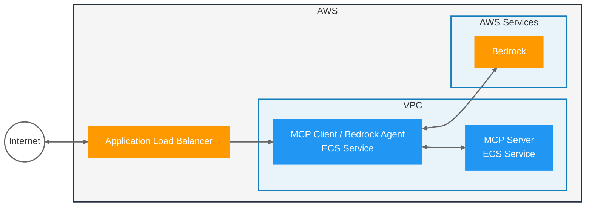

MCP Spring
==========

This repository contains a sample Spring AI MCP Server that runs on ECS; which is used by a Spring AI Agent using Bedrock; which also runs on ECS and is exposed publicly via a Load Balancer.

Keywords
---------

- Spring AI
- Model Context Protocol (MCP)
- Amazon Bedrock
- Amazon Elastic Container Service (ECS)
- Kotlin

Architecture
------------

References
----------

- Running MCP-Based Agents (Clients & Servers) on AWS, _https://community.aws/content/2v8AETAkyvPp9RVKC4YChncaEbs/running-mcp-based-agents-clients-servers-on-aws_
- Sample: MCP Agent with Spring AI and Bedrock, _https://github.com/aws-samples/Sample-Model-Context-Protocol-Demos/tree/main/modules/spring-ai-agent-ecs_
